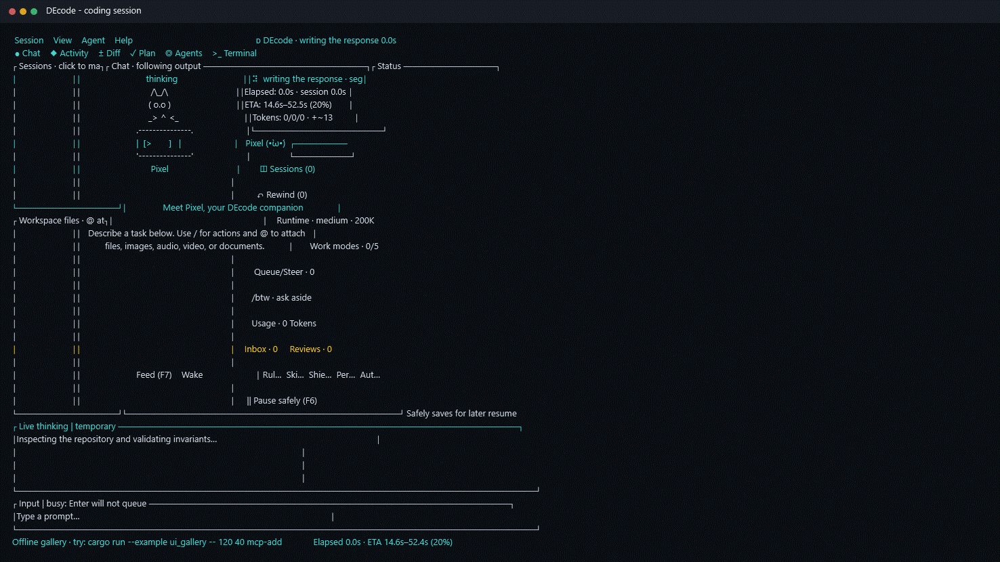

# DEcode

**A local-first, safety-focused AI coding agent for the terminal.**

[Русская версия](README.ru.md) · [Documentation](docs/README.md) · [Features](docs/FEATURES.md) · [Security](docs/SECURITY.md) · [Contributing](CONTRIBUTING.md)

[](https://github.com/denysoid/DEcode/actions/workflows/terminal-matrix.yml)
[](https://github.com/denysoid/DEcode/releases)
[](LICENSE)
[](rust-toolchain.toml)
[](docs/INSTALLATION.md)

<p align="center">
  
</p>

> [!IMPORTANT]
> DEcode is an early public preview. It can execute commands and modify files. Use Git, inspect approvals and diffs, and keep independent backups of valuable work.

DEcode combines a mouse-friendly `ratatui` interface with a bounded coding-agent runtime. It streams model output, preserves durable sessions, reviews file changes, runs tools through a workspace capability sandbox, and supports multiple providers without moving filesystem or command authority into provider-specific code.

## What DEcode provides

- Local terminal workflow with mouse support and complete keyboard navigation.
- Persistent sessions with resume, fork, rename, pin, archive, search, pause, cancellation, and crash recovery.
- Exact patch review, command approval, Git-backed checkpoints, and conflict-safe rewind.
- Plan, Explore, Review, Goal, and Deep Thinking modes with independent permissions.
- Recursive research and writer sub-agents with DAG dependencies, budgets, file claims, and isolated Git worktrees.
- MCP, LSP, repository indexing, optional embeddings, plugins, skills, hooks, custom commands, and GitHub pull-request workflows.
- Images, documents, text, audio, and video attachments with content verification and provider capability checks.
- Twelve UI languages and deterministic cross-platform terminal-layout tests.

See the [feature matrix](docs/FEATURES.md) for implemented behavior and explicit limits.

## Project status

Version `0.1.0` targets technical users comfortable with Rust builds and provider configuration. Azure OpenAI is the primary reference route. Other adapters have local and integration coverage, but behavior can still differ by model revision, deployment, terminal emulator, proxy, region, and account policy.

The source repository does not track compiled executables. Build locally, or use a GitHub Release after one is published.

## Documentation

| Topic | English | Русский |
|---|---|---|
| Install on Windows, Linux, and macOS | [Installation](docs/INSTALLATION.md) | [Установка](docs/INSTALLATION.ru.md) |
| Providers, keys, endpoints, and context | [Configuration](docs/CONFIGURATION.md) | [Настройка](docs/CONFIGURATION.ru.md) |
| Tasks, files, sessions, pause, and recovery | [Usage](docs/USAGE.md) | [Использование](docs/USAGE.ru.md) |
| Startup, API, context, and attachment errors | [Troubleshooting](docs/TROUBLESHOOTING.md) | [Решение проблем](docs/TROUBLESHOOTING.ru.md) |
| Keyboard and mouse controls | [Keymap](docs/KEYMAP.md) | [Управление](docs/KEYMAP.ru.md) |
| Trust boundaries | [Security model](docs/SECURITY.md) | [Модель безопасности](docs/SECURITY.ru.md) |
| Runtime design | [Architecture](docs/ARCHITECTURE.md) | [Архитектура](docs/ARCHITECTURE.ru.md) |

## Requirements

- Current stable Rust installed through [rustup](https://rustup.rs/), with `rustfmt` and `clippy`.
- Git for checkout, checkpoints, rewind, and writer worktrees.
- A UTF-8 terminal; mouse input is optional.
- Credentials for one supported model provider, unless using a local no-key Ollama setup.
- Optional: authenticated GitHub CLI (`gh`) for PR features and installed language servers for LSP features.

## Build and run

### Download a published release

When a version is available, download the archive for your operating system from [GitHub Releases](https://github.com/denysoid/DEcode/releases) together with its `.sha256` file. Verify it with `Get-FileHash` on Windows, `sha256sum --check` on Linux, or `shasum -a 256 --check` on macOS before extraction. Release archives contain the native executable, both README files, and the license.

### Build from source

Clone once:

```bash
git clone https://github.com/denysoid/DEcode.git
cd DEcode
cargo build --locked --release
```

### Windows PowerShell

```powershell
.\target\release\decode.exe --workspace "D:\projects\my-app"
```

### Windows CMD

```bat
target\release\decode.exe --workspace "D:\projects\my-app"
```

### Linux and macOS

```bash
./target/release/decode --workspace /home/user/projects/my-app
```

Run directly through Cargo when developing:

```bash
cargo run --locked --release -- --workspace /absolute/path/to/project
```

`--workspace` requires an existing directory value. DEcode is a terminal application; on Windows, run the EXE from PowerShell, CMD, or Windows Terminal instead of double-clicking it so startup errors remain visible.

Platform prerequisites, Cargo installation, updates, and removal are covered in [Installation](docs/INSTALLATION.md).

## First launch

When no completed user configuration exists, the setup wizard asks for:

1. interface language;
2. provider and model/deployment;
3. endpoint and authentication method when required;
4. workspace and agent purpose;
5. context ceiling, transport, timeout, and retry settings.

Secrets entered in the wizard are stored in the operating-system keyring under the `decode-provider` service. They are not written to TOML, session journals, or logs. The wizard may be skipped; it opens again while no completed user configuration exists.

For reproducible startup, pass both paths explicitly:

```powershell
.\target\release\decode.exe `
  --config "D:\decode-config\config.toml" `
  --workspace "D:\projects\my-app"
```

```bash
./target/release/decode \
  --config "$HOME/.config/decode/config.toml" \
  --workspace "$HOME/projects/my-app"
```

Copy [config.example.toml](config.example.toml) for the complete annotated configuration. CLI flags override environment variables, which override trusted user configuration, which overrides built-in defaults. A workspace `.decode.toml` can set only a restricted project-safe subset.

## Credentials and providers

Prefer the setup wizard or process environment variables. An env file is never discovered automatically; pass it explicitly and keep it outside the workspace:

```powershell
$env:AZURE_OPENAI_API_KEY = "your-key"
.\target\release\decode.exe --workspace "D:\projects\my-app"
```

```bash
export OPENAI_API_KEY="your-key"
./target/release/decode --workspace /home/user/projects/my-app
```

```text
decode --env-file /outside/workspace/decode.env --workspace /path/to/project
```

Never commit API keys, bearer tokens, account-specific endpoints, session data, or populated local configuration. [.env.example](.env.example) shows the accepted file syntax; [Configuration](docs/CONFIGURATION.md) lists every provider variable.

| API family | Supported routes |
|---|---|
| Responses | Azure OpenAI, OpenAI, Bedrock Mantle, explicit compatible endpoints |
| Native | Google Gemini, Anthropic Claude, AWS Bedrock Runtime `ConverseStream` |
| Chat Completions | OpenRouter, xAI, Groq, Mistral, DeepSeek, Together, Fireworks, Cerebras, Perplexity, NVIDIA NIM, SambaNova, Moonshot, DashScope, Hugging Face, GitHub Models, Ollama |

Provider switching changes request serialization and authentication, not tool authority. DEcode rejects unsupported attachment modalities before network transmission instead of silently converting or truncating them.

## First useful task

1. Start in the intended workspace.
2. Describe the result, constraints, and verification command.
3. Add files with `@`, paste an image with `Ctrl+V`, or paste/drop absolute file paths.
4. Review every requested command and patch.
5. Inspect the final answer and `git diff`.
6. Run the project's tests before committing.

Example request:

```text
Fix the failing parser test without changing the public format. Add a regression
test for the malformed input, run the focused test and full formatter, then list
the changed files and any remaining risk.
```

## Essential controls

| Input | Action |
|---|---|
| `F10` | Open menu bar |
| `/` in an empty composer | Open command palette |
| `@` | Attach one or more files from workspace, home, Desktop, Downloads, or any filesystem root/drive |
| `Ctrl+V` | Paste text or capture a clipboard image |
| `Alt+Enter` | Insert a newline |
| `Ctrl+N` / `Ctrl+O` | Create a session / open session manager |
| `Ctrl+M` | Select model, reasoning effort, and context budget |
| `F6` / `F8` | Pause or resume / cancel a paused turn |
| `F7` | Feed or wake Pixel while idle |
| `Ctrl+C` / `Esc` | Interrupt active work or leave the current screen |
| `Tab` / `Shift+Tab` | Move between interactive controls |

The [complete keymap](docs/KEYMAP.md) covers dialogs, tool cards, lists, agents, usage, and interactive terminals.

## Attachments

Text and multiple files can be sent in the same turn. The `@` browser supports navigation and multi-selection. Clipboard images are captured as bytes rather than sent as temporary paths. Compatible terminal drag-and-drop is recognized through the absolute paths emitted by the host terminal.

External files are copied into a content-addressed session store and verified by SHA-256 before use. Default limits are 16 files, 50 MiB per file, and 50 MiB total per turn. Large text pastes become text attachments instead of being cut off in the editor.

## Sessions, context, and recovery

Session journals are checksummed append-only JSONL with torn-tail recovery. Every session remembers its context budget; the last explicit change becomes the default for newly created sessions without rewriting older ones.

Local compaction preserves the initial task anchor and newest complete causal tool group, records a visible event, and rejects a request that cannot fit without losing required state. Cumulative session usage is separate from the size of the most recent provider request.

Pause and interruption persist the last confirmed causal boundary. Resume starts a new provider request from durable history; DEcode never claims to continue a closed stream or to have executed an incomplete tool call. Logical-turn time, token, and cost totals include completed work before a recoverable pause/retry.

## Safety model

Model output, repository content, tool output, MCP/LSP data, plugins, and remote responses are untrusted.

- Project code uses `#![forbid(unsafe_code)]` and strict Clippy gates.
- Model file access is capability-scoped to the workspace and rejects traversal and symlink/reparse escape.
- Mutations use exact patches or atomic writes and can require hunk review.
- Commands have null stdin, time/output limits, cancellation, process-tree cleanup, and approval policies.
- Incomplete streamed calls never execute.
- Secrets use environment variables or OS keyring storage and are scrubbed from errors/tracing.
- MCP, remote embeddings, plugins, hooks, and auto-approval remain explicit trust decisions.

Read the [security model](docs/SECURITY.md) before enabling privileged integrations. Report vulnerabilities through the [security policy](SECURITY.md), not a public issue containing exploit details.

## Architecture

The orchestrator is the single owner of API, history, tools, sessions, checkpoints, sub-agents, MCP/LSP, indexing, plugins, and UI snapshots. UI code sends typed commands and renders immutable snapshots; it does not execute business operations.

```text
input / TUI -> OrchestratorCommand -> agent actor -> API / tools / runtimes
     ^                                    |
     +----------- snapshots/events <------+
```

Read [Architecture](docs/ARCHITECTURE.md) before changing cross-module behavior.

## Repository layout

```text
src/                     application and library code, including unit tests
tests/                   integration and acceptance tests
examples/ui_gallery.rs   deterministic offline TUI renderer
examples/configuration/  agent, command, hook, instruction, and privacy examples
examples/plugin/         minimal plugin package example
assets/demo.gif          README demonstration generated from the real UI
scripts/                 maintainer utilities
docs/                    paired EN/RU user and technical guides
.github/                  CI, ownership, issue forms, and pull-request template
config.example.toml      complete annotated configuration reference
```

Local configuration, sessions, logs, build artifacts, release binaries, backups, and private dumps are intentionally excluded from Git.

## Development

Run the same gates as CI:

```bash
cargo fmt --all -- --check
cargo check --locked --all-targets
cargo clippy --locked --all-targets -- -D warnings
cargo test --locked --all-targets
```

Render deterministic UI scenes without credentials:

```bash
cargo run --locked --example ui_gallery -- 54 24 chat en dark
cargo run --locked --example ui_gallery -- 120 40 chat ru dark
cargo run --locked --example ui_gallery -- 160 50 mcp-add en light
```

On Windows, regenerate the README animation from those real gallery scenes with:

```powershell
.\scripts\render-readme-demo.ps1
```

CI runs Rust gates on Windows, Linux, and macOS, exercises Unix PTY and Windows ConPTY behavior, and renders 288 combinations of locale, theme, screen, and terminal size.

Read [CONTRIBUTING.md](CONTRIBUTING.md) before submitting a change and [CHANGELOG.md](CHANGELOG.md) for release notes.

## Support and license

Start with [Troubleshooting](docs/TROUBLESHOOTING.md) and the [support policy](SUPPORT.md), then search existing issues and open the matching structured form with sanitized diagnostics. Security reports follow [SECURITY.md](SECURITY.md), and participation is governed by the [Code of Conduct](CODE_OF_CONDUCT.md).

DEcode is distributed under the [MIT License](LICENSE).
